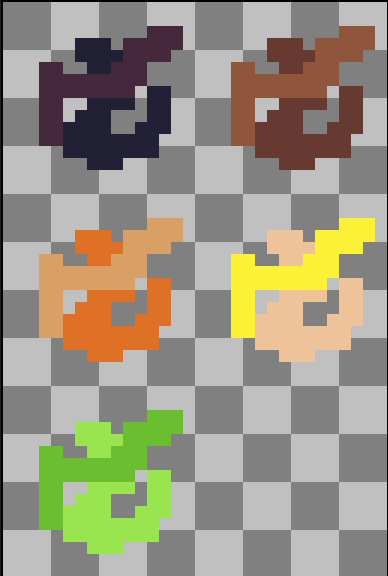
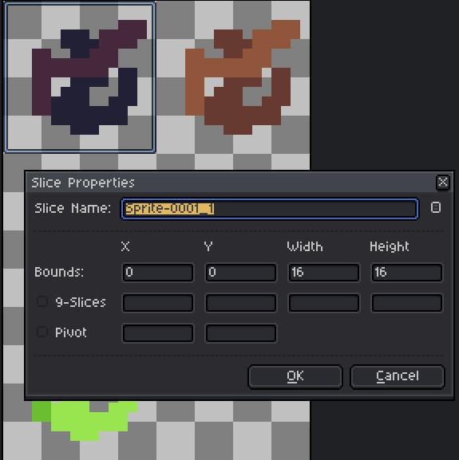
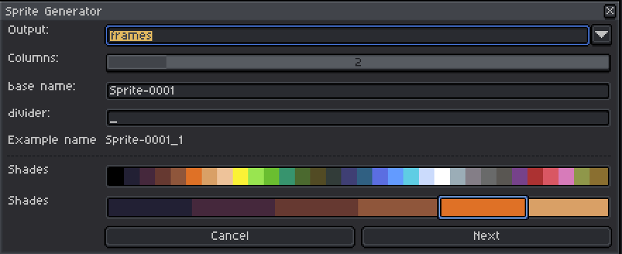
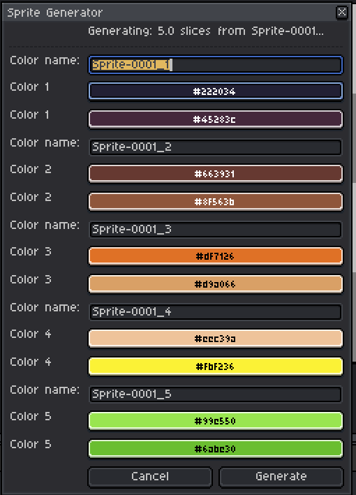

# Color variation generator extension for Aseprite

## Basics

This extension will generate variations of a sprite based on color pair you select.

White is replaced by the first color, black is replaced by the second color.

## Limitations

Right now you have to make sure the sprite image covers the whole width and height of the canvas (no transparent pixels on the edges), when generating slices.
You can color the transparent pixels with a placeholder color (like magenta) and then replace them with transparency in the output.

## Setup

### Output
`frames` - Output variations as frames

`sprites` - Output variations as  different sprites

`slices` - Output variations as a sprite sheet with slices

`columns` - Number of columns in the output sheet

### Name

`base name` - First part of the output file name

`divider` - Divider between the base name and the variation name

### Colors

`Palette` - Current palette, click colors to add them to the variations

`Shades` - Selected colors, will generate a variation for each pair of colors

## Generation

Here you can tweak the colors and name the variations.

